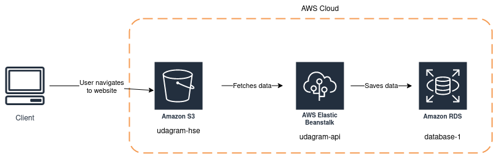
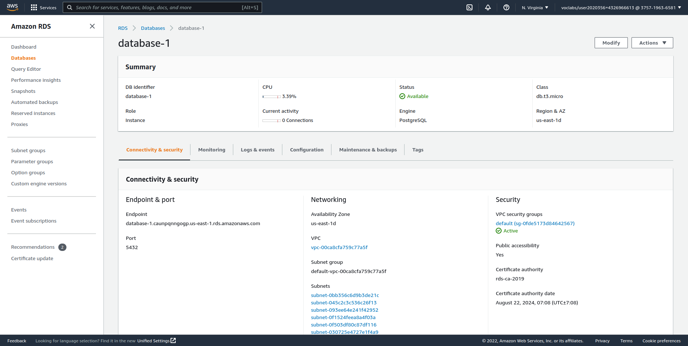
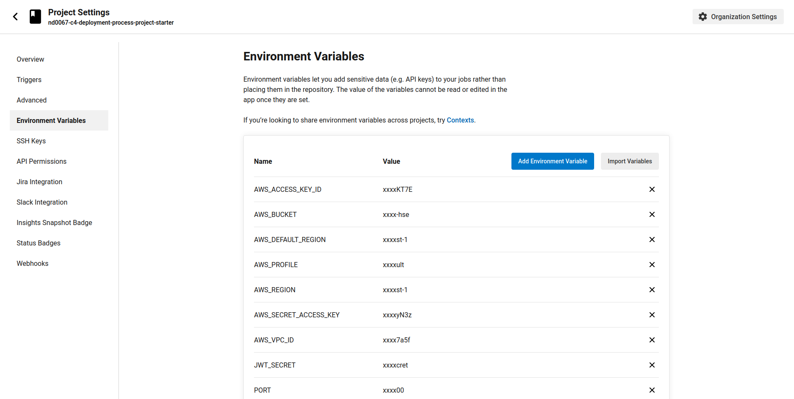

# Udagram

This project is part of the Udacity Full Stack Developer nanodegree.
And the code is forked from https://github.com/udacity/nd0067-c4-deployment-process-project-starter

The udagram application is a fairly simple application that includes all the major components of a Full-Stack web application.

Hosted on: http://udagram-hse.s3.amazonaws.com/index.html

### Dependencies

```
- Node v14.15.1 (LTS) or more recent. While older versions can work it is advisable to keep node to latest LTS version

- npm 6.14.8 (LTS) or more recent, Yarn can work but was not tested for this project

- AWS CLI v2, v1 can work but was not tested for this project

- A RDS database running Postgres.

- A S3 bucket for hosting uploaded pictures.

```

### Cloud Architecture



### Installation

Provision the necessary AWS services needed for running the application:

1. In AWS, provision a publicly available RDS database running Postgres.


1. In AWS, provision a s3 bucket for hosting the uploaded files.


1. Add the ENV variables needed to CircleCI project configurations.


## Testing

This project contains two different test suite: unit tests and End-To-End tests(e2e). Follow these steps to run the tests.

1. `cd starter/udagram-frontend`
1. `npm run test`
1. `npm run e2e`

There are no Unit test on the back-end

### Unit Tests:

Unit tests are using the Jasmine Framework.

### End to End Tests:

The e2e tests are using Protractor and Jasmine.

## Built With

- [Angular](https://angular.io/) - Single Page Application Framework
- [Node](https://nodejs.org) - Javascript Runtime
- [Express](https://expressjs.com/) - Javascript API Framework

## License

[License](LICENSE.txt)
